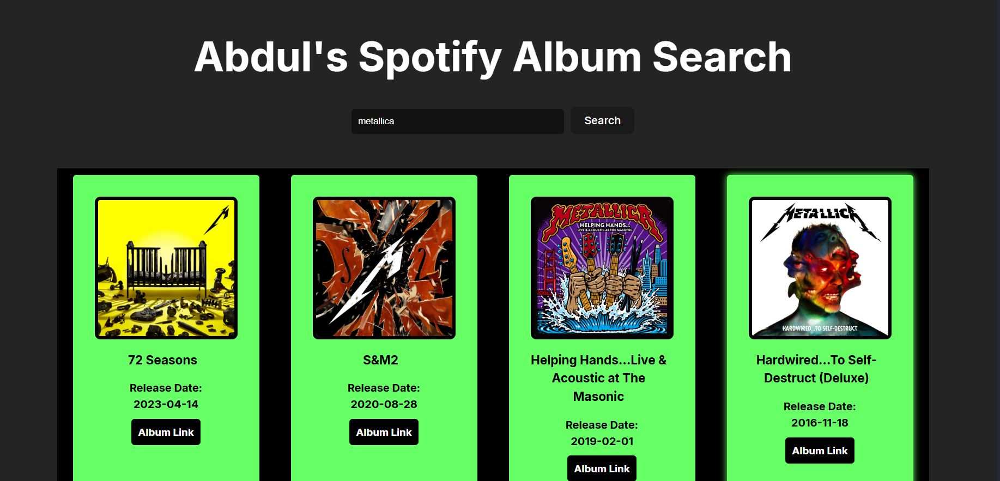

# Spotify Album Finder

A React web application that allows users to search for any artist and view their albums using the Spotify API.

## Features

- 🔍 **Artist Search:** Enter an artist's name to find their albums.
- 💿 **Album Gallery:** Displays album covers, names, and release dates.
- 🎵 **Direct Spotify Links:** Each album card includes a button to open the album on Spotify.
- ✨ **Modern UI:** Clean, responsive design with interactive hover effects.

## Demo



## Getting Started

### Prerequisites

- [Node.js](https://nodejs.org/) (v14 or higher recommended)
- [npm](https://www.npmjs.com/) or [yarn](https://yarnpkg.com/)

### Spotify API Credentials

1. Create a Spotify Developer account at [Spotify Developer Dashboard](https://developer.spotify.com/dashboard/).
2. Create a new application to get your **Client ID** and **Client Secret**.
3. Create a `.env` file in the root of your project and add:

   ```
   VITE_CLIENT_ID=your_spotify_client_id
   VITE_CLIENT_SECRET=your_spotify_client_secret
   ```

### Installation

1. Clone the repository:

   ```bash
   git clone https://github.com/yourusername/spotify-album-finder.git
   cd spotify-album-finder
   ```

2. Install dependencies:

   ```bash
   npm install
   # or
   yarn install
   ```

3. Start the development server:

   ```bash
   npm run dev
   # or
   yarn dev
   ```

4. Open [http://localhost:5173](http://localhost:5173) in your browser.

## Usage

- Type an artist's name in the search bar and press **Enter** or click **Search**.
- Browse the albums displayed.
- Click **Album Link** to open the album on Spotify.

## Technologies Used

- [React](https://react.dev/)
- [Vite](https://vitejs.dev/)
- [React Bootstrap](https://react-bootstrap.github.io/)
- [Spotify Web API](https://developer.spotify.com/documentation/web-api/)

## Folder Structure

```
Spotify Album Finder/
  ├── public/
  ├── src/
  │   ├── App.jsx
  │   ├── App.css
  │   └── ...
  ├── index.html
  ├── package.json
  └── README.md
```

## License

This project is licensed under the MIT License.